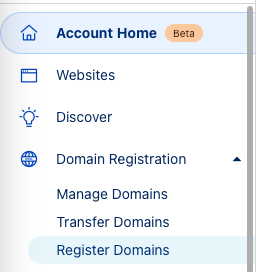
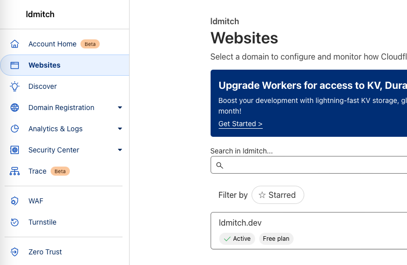
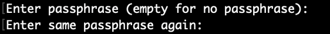

+++
author = "Liam Mitchell"
title = "Cloudflare With Vultr"
date = 2024-07-15T19:20:20-07:00
lastmod = 2024-07-15T19:20:20-07:00
description = "How to secure access to a Vultr server with a Cloudflare tunnel"
draft = true
tags = ["vultr", "cloudflare"]
+++

## Motivation

There is an endless supply of short tutorials on how to setup your own virtual private server (VPS), connect via SSH, install a web server, etc. After trying a few different hosting providers, I found a setup that works for me and is cheap, easy to configure, and secure.

The purpose of this post is to aggregate and provide context around some of the official documentation from Cloudflare and Vultr, who should hopefully keep their stuff up-to-date. We will be deploying a new VPS on Vultr, installing a Cloudflare tunnel, dropping all incoming connections with the Vultr firewall, and restricting access to the tunnel with Cloudflare Zero Trust.

:::note
Requires a paid domain name and paid Vultr account
:::

## 1: Buy a domain name with Cloudflare

While it is not strictly necessary that the domain is purchased with Cloudflare as the registrar, it will simplify the setup process of the server. I will be summarizing [these instructions](https://developers.cloudflare.com/registrar/get-started/register-domain).

- Go to the [Cloudflare dashboard](https://dash.cloudflare.com/) and either create an account or sign-in to an existing one.
- On the left-hand side bar, click the "Domain Registration" dropdown and then "Register Domains": 
- Search for the root name you want, like "ldmitch", and optionally add the top-level domain like ".dev"
- Fill in the requested details for your domain. While your real name and address are required to register the domain, Cloudflare will redact almost all of this information publicly, so that your domain name will not be associated with your phone number, address, etc.
  - You can read about redaction [here](https://developers.cloudflare.com/registrar/account-options/whois-redaction/), and you can see an example of what the publicly available data looks like after registration by searching for my domain, [ldmitch.dev](https://ldmitch.dev), in [Cloudflare's RDAP portal](https://rdap.cloudflare.com). You will notice that the only information available about me is my country code, "CA", and province, "BC".

## 2: Configure the new domain's security settings

There are some very simple steps we can take to increase the security of whatever services we want to host on the domain. From the Cloudflare dashboard, click "Websites" and then select your new domain:  Use the new website side bar on the left hand side of the page to access all the settings listed below.

- Go to "DNS" > "Settings" and enable [DNSSEC](https://developers.cloudflare.com/dns/dnssec/). Follow the prompts and note that it could take some time for DNSSEC to be fully enabled, but you can move on with the following steps without having to stick around and wait.
- Go to "SSL/TLS" > "Overview" and set the [encryption mode](https://developers.cloudflare.com/ssl/origin-configuration/ssl-modes/) to [Full (strict)](https://developers.cloudflare.com/ssl/origin-configuration/ssl-modes/full-strict/).
- Go to "SSL/TLS" > "Edge Certificates":
  - Enable [Always Use HTTPS](https://developers.cloudflare.com/ssl/edge-certificates/additional-options/always-use-https/).
  - Set the [Minimum TLS Version](https://developers.cloudflare.com/ssl/edge-certificates/additional-options/minimum-tls/) to 1.2 and [Enable TLS 1.3](https://developers.cloudflare.com/ssl/edge-certificates/additional-options/tls-13/).
  - Enable [Automatic HTTPS Rewrites](https://developers.cloudflare.com/ssl/edge-certificates/additional-options/automatic-https-rewrites/).
  :::warning
  Be careful changing the HSTS settings below unless you have read what each one does
  :::
  - Change the [HTTP Strict Transport Security (HSTS)](https://developers.cloudflare.com/ssl/edge-certificates/additional-options/http-strict-transport-security/) settings and toggle all [configuration options](https://developers.cloudflare.com/ssl/edge-certificates/additional-options/http-strict-transport-security/#configuration-settings) on, except for the "Max Age Header" unless you are sure you can increase it from zero. If you want to read more about HSTS and the `max-age` header, see the [MDN docs](https://developer.mozilla.org/en-US/docs/Web/HTTP/Headers/Strict-Transport-Security) and Google's [HSTS Preload List](https://hstspreload.org).
- Go to "Security" > "Settings" and optionally modify and of the available settings as you see fit.

## 3: Rent a VPS from Vultr

It is very straightforward to rent and deploy a VPS on Vultr. The (slightly more) difficult part will be to generate SSH keys, which is how we will authenticate when remotely connecting to the server. You can read about SSH on [Wikipedia](https://en.wikipedia.org/wiki/Secure_Shell) if unfamiliar with the protocol. I will be summarizing [these steps from GitHub](https://docs.github.com/en/authentication/connecting-to-github-with-ssh/generating-a-new-ssh-key-and-adding-it-to-the-ssh-agent) to generate SSH keys, and then [these instructions from Vultr](https://docs.vultr.com/deploy-a-new-server-with-an-ssh-key) to deploy the server.

I am using MacOS, and the instructions should be very similar for most Linux distributions, but there will be some additional steps required for Windows users.

- Open a terminal and enter the command below:

  ```sh
  ssh-keygen -t ed25519 -C "your_email@example.com"
  ```

- You will be asked to "enter a file in which to save the key", but you can just click `Enter` to use the default.
- You will be asked to enter a passphrase. This passphrase will be needed whenever you use your SSH key, so make it difficult to guess and save it in a password manager. If you have never typed a password into a terminal/console before, note that ***no placeholders will appear when typing***, and you will just need to click `Enter` when you have finished typing: 
  - As mentioned and shown above, there is no visual feedback when typing a passphrase. After submitting, you will need to enter the same passphrase again to confirm.
- If you want to avoid having to type out your passphrase everytime you use your keys https://docs.github.com/en/authentication/connecting-to-github-with-ssh/generating-a-new-ssh-key-and-adding-it-to-the-ssh-agent#adding-your-ssh-key-to-the-ssh-agent
