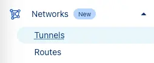

+++
author = "Liam Mitchell"
title = "Cloudflare With Vultr"
date = 2024-07-15T19:20:20-07:00
lastmod = 2024-07-15T19:20:20-07:00
description = "How to secure access to a Vultr server with Cloudflare Tunnel"
draft = true
tags = ["vultr", "cloudflare"]
+++

## Motivation

## Contents

1. [Buy a domain](#1-buy-a-domain-name-with-cloudflare)
2. [Configure the domain](#2-configure-the-new-domains-security-settings)

## 1: Buy a domain name with Cloudflare

While it isn't strictly necessary to use Cloudflare as your registrar, it will
simplify the setup process of the server since you can quickly enable security
settings for your domain and setup appropriate DNS records. The instructions
below summarize the official
[Cloudflare documentation](https://developers.cloudflare.com/registrar/get-started/register-domain):

- Go to the [Cloudflare dashboard](https://dash.cloudflare.com/) and either
  create an account or sign-in to your existing one.
- On the left-hand side bar, click the "Domain Registration" dropdown and then
  "Register Domains":
  
  

- Search for the root name you want, like "ldmitch", and optionally add the
  top-level domain like ".dev" that you want to buy.
- Fill in the requested details for your domain. While your real name and
  address are required to register the domain, Cloudflare will redact almost all
  of this information so that your domain name will not be publicly associated
  with your phone number, address, etc.
  - You can read about redaction [here](https://developers.cloudflare.com/registrar/account-options/whois-redaction/),
    and you can see an example of what the publicly available data looks like
    after registration by searching for my domain, [ldmitch.dev](https://ldmitch.dev),
    in [Cloudflare's RDAP portal](https://rdap.cloudflare.com). Notice that even
    after Cloudflare's redaction, my country code, "CA", and province, "BC", are
    still public.

## 2: Configure the new domain's security settings

There are some very simple steps you can take to increase the security of your
domain. From the Cloudflare dashboard, click "Websites" and then select your new
domain: 

 

Use the side bar on the left hand side of the page to access all of the settings
mentioned below:

I have linked to the relevant Cloudflare documentation page for each setting
listed. Please read the linked page(s) carefully before altering any setting if
you don't know what it does.

- Go to "DNS" > "Settings" and enable [DNSSEC](https://developers.cloudflare.com/dns/dnssec/).
  Follow the prompts and note that it could take some time for changes to
  propogate, but you can move on with the following steps without having to
  stick around and wait.
- Go to "SSL/TLS" > "Overview" and set the
  [encryption mode](https://developers.cloudflare.com/ssl/origin-configuration/ssl-modes/)
  to [Full (strict)](https://developers.cloudflare.com/ssl/origin-configuration/ssl-modes/full-strict/).
- Go to "SSL/TLS" > "Edge Certificates":
  - Enable [Always Use HTTPS](https://developers.cloudflare.com/ssl/edge-certificates/additional-options/always-use-https/).
  - Set the [Minimum TLS Version](https://developers.cloudflare.com/ssl/edge-certificates/additional-options/minimum-tls/)
    to 1.2 and [Enable TLS 1.3](https://developers.cloudflare.com/ssl/edge-certificates/additional-options/tls-13/).
  - Enable [Automatic HTTPS Rewrites](https://developers.cloudflare.com/ssl/edge-certificates/additional-options/automatic-https-rewrites/).
  - **Make sure to read all linked documentation for HSTS settings:** Change the
    [HTTP Strict Transport Security (HSTS)](https://developers.cloudflare.com/ssl/edge-certificates/additional-options/http-strict-transport-security/)
    settings and toggle all [configuration options](https://developers.cloudflare.com/ssl/edge-certificates/additional-options/http-strict-transport-security/#configuration-settings) on, setting the "Max Age Header" to at least 12 months. If you want to read more
    about HSTS and the `max-age` header, see the
    [MDN docs](https://developer.mozilla.org/en-US/docs/Web/HTTP/Headers/Strict-Transport-Security)
    and Google's [HSTS Preload List](https://hstspreload.org).
- Go to "Security" > "Settings" and optionally modify any of the available
  settings as you see fit.

## 3: Rent a VPS from Vultr

It's very straightforward to rent and deploy a VPS on Vultr with the web user
interface. I will summarize the steps but really you can just follow the prompts
and end up with the right product.

- Go to the [Vultr dashboard](https://my.vultr.com) and either create an account
  or sign-in to your existing one.
- Click the big blue "Deploy +" button at the top right of the screen and select
  "Cloud Compute - Shared CPU" (unless you know you need dedicted resources).
- Choose the closest region to you.
- Feel free to select the Linux operating system you are most familiar with, but
  note that Cloudflare Tunnel only natively supports Debian and Redhat-based
  distributions. You can pick Debian or Ubuntu, or any of the
  RedHat/Fedora-esque distros like Alma or CentOS. I will be using Ubuntu LTS.
  - [Cloudflare Tunnel](https://developers.cloudflare.com/cloudflare-one/connections/connect-networks/)
    is how we will secure SSH access to the server later.
- For the hardware plan (CPU, RAM, etc.), you can be conservative with what you
  pick at first. With Vultr, it's easy to upgrade to a more powerful VPS but you
  can't downgrade (yet). You should look up the hardware requirements of the
  services you're interested in hosting to decide. For instance, Matrix
  recommends at least 1 GB of RAM if you plan on joining large, federated rooms
  on a self-hosted Synapse server.
- For "Additional Features", make sure "IPv6" is selected, and then choose
  anything else you're interested in.
- Pick any server hostname and click "Deploy Now". Wait for the installation to
  complete and then we're good to go.

## 4: Install Cloudflare Tunnel

This next part is how we'll stop anyone from connecting to the server over SSH
except users you explicitly allow via
[Cloudflare Zero Trust](https://developers.cloudflare.com/cloudflare-one/).

- Open the [Cloudflare dashboard](https://dash.cloudflare.com) and select "Zero
  Trust" from the sidebar.

  

  - If this is your first time opening Zero Trust, you might get a prompt asking
    you to choose your Cloudflare account and whatnot. Just follow the prompts.
- You will get a brand new sidebar on your screen! Pick "Networks" and then
  "Tunnels".

  

- Click "Create a tunnel" and then pick the "Cloudflare***d***" option. You can
  choose whatever name you like, but picking the same name as your Vultr VPS may
  simplify things.
- You will now be prompted to "Install and run a connector". To do this, we are
  going to connect to the VPS via SSH:
  - From the [Vultr dashboard](https://my.vultr.com), click on your VPS. In the
    overview, you should see a few fields, namely an IP address, username, and
    password:

    

  - Open up a terminal or PowerShell window, then type
    `ssh <username>@<IP address>`, replacing the values with the ones listed
    for your VPS.
  - Follow the prompts shown in your terminal, and paste the password when
    asked. If things went smoothly, you should see `<username>@<VPS name>:~#` in
    your terminal. You can enter the `w` command to double check that you are
    logged in, as well as from what IP address you're connecting from:

    

    - I already have a tunnel setup on this server, so my client IP address (the
      "FROM" column) isn't shown here, but yours should be.
    - Returning now to "Install and run connectors" page of the tunnel
      configuration, choose either Debian or RedHat depending on what your VPS
      OS is based on.
    - Select "64-bit" as your architecture, then copy the command labeled for
      "If you don't have cloudflared installed on your machine".
    - Paste the copied command into your terminal with the active SSH
      connection, and wait for it to finish.
    - Return to the tunnel page in your browser, and you should see a new entry
      under "Connectors", meaning that your VPS was connected successfully.
    - Click "Next", and then fill out the fields like I have below, choosing
      your domain name from the dropdown menu:

      

    - Once the fields are filled out correctly, you can save the tunnel.
