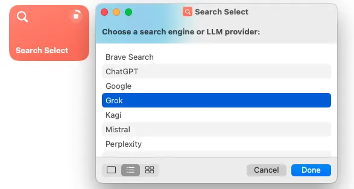
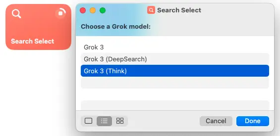
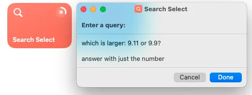
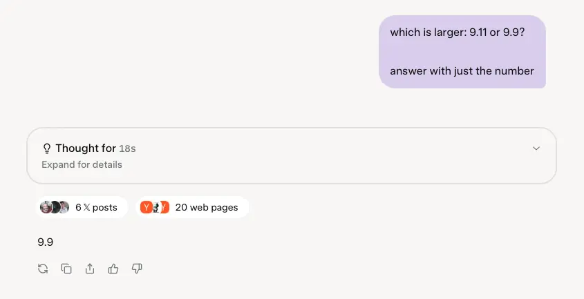
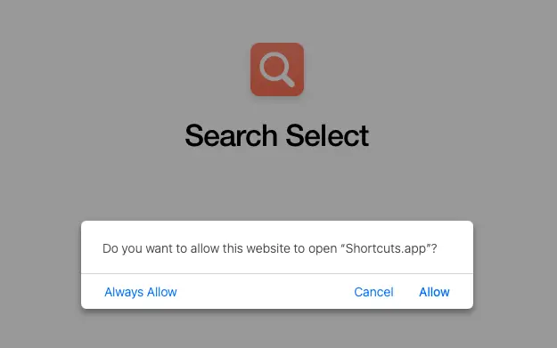
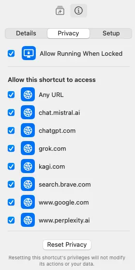

+++
author = "Liam Mitchell"
title = "Search Select"
date = 2025-02-22
lastmod = 2025-04-16
description = "An Apple Shortcut to easily access multiple search engines and LLMs"
draft = false
tags = ["search", "ai", "web"]
+++

## A shortcut to choose a search engine or LLM

To skip my meandering, install the shortcut from this link:

https://www.icloud.com/shortcuts/68fac5b11c2f486a8a4f29a7fe0041b9

## Motivation

With the recent releases of DeepSeek-R1, OpenAI's o3-mini, and xAI's Grok 3
models, there are plenty of highly intelligent, web-enabled LLMs to choose from
to solve any given problem someone might have. Search engines have also begun to
implement AI summaries of results—Google's Gemini, Kagi's "Quick Answer",
and Brave Leo, for example—so that a user can get an almost immediate response
to their query without having to open any links.

These tools all have varying usage limits, privacy policies, prices, and
geographical availability. And beyond even those technical limitations, they all
have varying intelligence capabilities, strengths, and weaknesses. For instance,
of all the search engines I have tried, I generally find the best results with
Kagi. However, Kagi's "Quick Answer" feature, while powered by an LLM, is not
nearly as intelligent as frontier reasoning models like Grok 3. But Kagi is
much, much faster. So there are different reasons I might need to use one tool
or another, depending on the circumstances.

To facilitate better use of all of these tools, I built an Apple Shortcut that
allows me to select a search engine or LLM, enter a query, and have that query
immediately sent to the chosen tool in my default browser. This shortcut,
"Search Select", can be added to the macOS dock or bound to the action button on
recent iPhones. This makes it incredibly easy to quickly select a tool, enter a
query, and get a response back.

The reason for writing this post is to briefly explain how the shortcut works
(it is quite simple) and how to install it.

## Contents

- [Shortcut structure](#shortcut-structure--usage)
- [Installation](#installation)
- [Triggering the shortcut](#triggering-the-shortcut)

## Shortcut structure & usage

The structure is not terribly complex. To start, you will choose one option from
a list of providers. The current list is made up of:

- Brave Search
- ChatGPT
- Google
- Grok
- Kagi
- Mistral
- Perplexity

For ChatGPT and Grok, you will also need to pick a specific model option for
that provider. This could be something like `o4-mini-high (web)` or just the
base `Grok 3` model. These specific models and options (like web access or
"Think" mode) are configured through URL parameters that are supported by
ChatGPT or Grok. For instance, the full URL used for `o4-mini-high (web)` is:

https://chatgpt.com/?temporary-chat=true&model=o4-mini-high&hints=search&q=%s

The final parameter, `q=%s`, is where your actual question/message will be
attached.

After making a provider selection, you will enter your query in the text box
that opens. This message will be URL encoded and put in place of the `%s` seen
in that last URL parameter shown above. For LLMs specifically, you can still
use line breaks with the Enter key. On iOS, you can submit the message by
tapping the blue "Done" button, and on macOS, either click that same button or
use Cmd + Enter to submit. In either case, just clicking the Enter key *will
not* submit your message, and will instead add a line break.

Upon submitting, your message will be sent to the chosen search engine or LLM,
and the respective web page will open in your default browser. For some
services, such as Kagi and Grok, you will need to be signed-in to an account in
your browser before you can get a response to your query. For ChatGPT, some
models like o1 and o3-mini-high will require a paid plan. This shortcut does not
use any public APIs, so you will still need to interact with each service's
website directly, if you decide to use them.

## Installation

The installation process is easy—on your Apple device, just open this link:

https://www.icloud.com/shortcuts/c1c509844dd44c3382e0dccbfbb18985

Click the "Get Shortcut" button at the bottom of the screen and allow iCloud to
open the Shortcuts app. From there, you can preview the shortcut by clicking the
ellipsis menu (button with three dots). Then, all you need to do is click the
"Add Shortcut" button, and my shortcut will be added to your library.

While this shortcut does not send data off anywhere or execute arbitrary code
(both of which *are* possible with shortcuts), you should still check out the
whole shortcut from top-to-bottom, as you should with any third-party software
you install. This will also help to familiarize yourself with the structure, so
that you can make any changes you want more easily

## Triggering the shortcut

To trigger the shortcut, all you need to do is click/tap on it. However, if you
want to make it easier to use the shortcut in the future:

macOS: Right-click on the shortcut icon and then click "Add to Dock". This will
add Search Select to your dock, and you can click it whenever you want to
trigger it.

iOS: On recent iPhones, you can bind Search Select to the action button. To do
so, open the Settings app, pick "Action Button", then swipe left until you get
to the "Shortcut" option. Just pick "Search Select" from the list. Now, to
trigger it, just hold your action button briefly.
